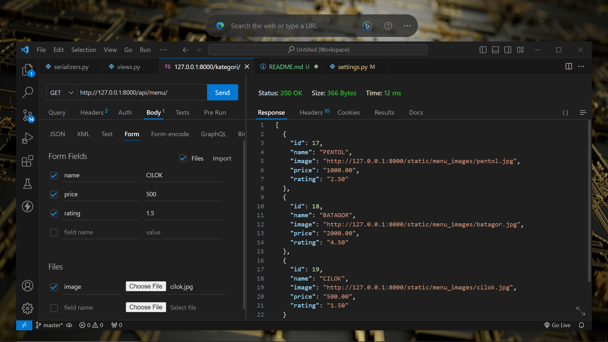

<div class="" align="center">
    <p>Api Menu Book</p>
    <h1>API MENU BOOK</h1>
    <span>✨⭐⭐⭐✨</span>
    <hr>
    
    <br>
</div>

## Setup Project

<strong>Instalasi</strong>

- 📍&nbsp;&nbsp;[Install Python (Python Official)](https://www.python.org/)
- 📗&nbsp;&nbsp;Clone repository
```bash
git clone https://github.com/ENONGLOSKER/API-MENU_BOOK
```
- 📁&nbsp;&nbsp;Buat env
```bash
python -m venv env
```
- 📁&nbsp;&nbsp;Aktifkan env
```bash
env\Scripts\activate
```
- 📁&nbsp;&nbsp;Masuk ke Folder
```bash
cd API-MENU_BOOK
```
- 📁&nbsp;&nbsp;Install requirements
```bash
pip install -r requirement.txt
```
- 📁&nbsp;&nbsp;Run Server
```bash
python manage.py runserver
```
<br>